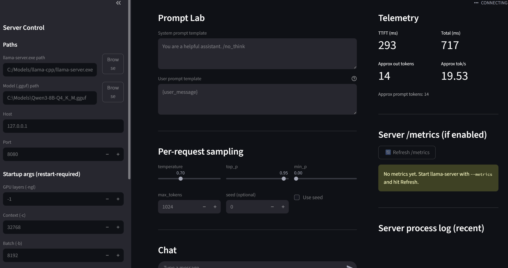

# llama-server-helper-ui
This project will help you view performance metrics and try out different args before deciding on a final model

Uses llama-server to run the model, grab it from the main repo. THIS ONLY WORKS LOCALLY<br>

Currently only made this project to handle `.gguf` since thats what i'm mainly using.



## Requirements
Cuda <br>
Python <br>

## To run
1. clone repo
```
git clone https://github.com/clarenceagcc/llama-server-helper-ui.git
```
2. install requirements
```
pip install -r requirements.txt
```
3. run the ui
```
streamlit run main.py
```
4. select the `llama-server.exe` and the model `.gguf`


